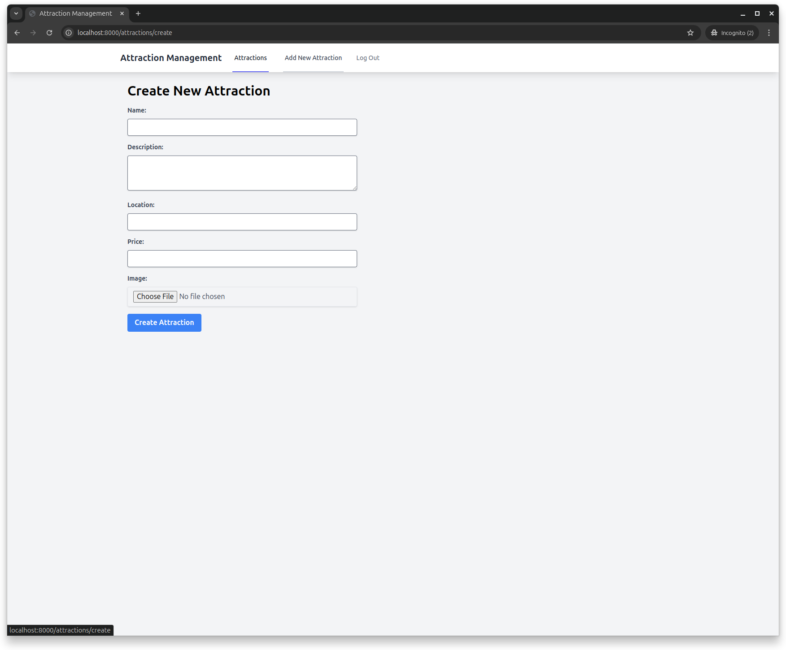

### Install

In order to install the project, you need to have installed:
- PHP 8.3
- Composer
- NPM

First, clone the repository:

```bash
git clone git@github.com:dlondero/attraction-management.git
cd attraction-management
```

#### Step 1

If you have `make` installed, you can use the following command to execute all the above steps:

```bash
make install
```

Make sure to answer `yes` to the question about creating the database.

#### Step 1 (alternative)

```bash
composer install
npm install
npm run build
php artisan storage:link
php artisan migrate
php artisan db:seed
```

Make sure to answer `yes` to the question about creating the database.

#### Step 2

Create a `.env` file by copying the `.env.example` file and update the environment variables:

```bash
cp .env.example .env
```

For the purpose of the test project the most important variables are:

```bash
PUSHER_APP_ID=
PUSHER_APP_KEY=
PUSHER_APP_SECRET=
OPENWEATHER_API_KEY=
```

### Usage

```bash
php artisan serve
```

or is you have `make` installed:

```bash
make dev
````

Browse from [http://localhost:8000](http://localhost:8000).

UserSeeder creates:
- an `admin` with email `admin@example.com` and password `password`
- a `user` with email `user@example.com` and password `password`

`admin` has all permissions on existing attractions and add new ones, `user` has only `view` permissions.

For convenience emails will be sent to `mail` log channel, you can check them in `storage/logs/mail.log`.

### Screenshots

Screenshots are available in the `screenshots` directory.

#### Admin




#### User


### Tests

To run tests use:

```bash
php artisan test
```
